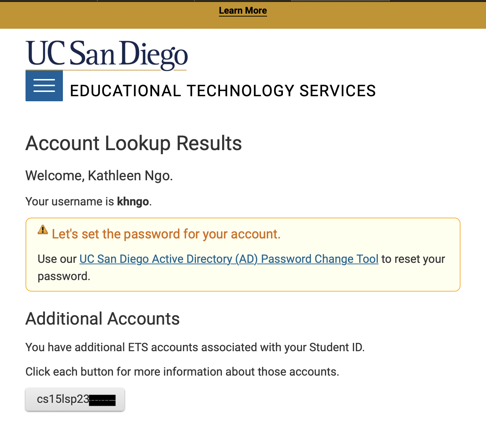

# Lab Report 1 
     Before learning the different tools and techniques as a programmer for this course, let's learn how to set up your accounts and installing the needed source-code editor. 

## **Step 1: Creating Your CSE15L Account**
1. Go into this [link](https://sdacs.ucsd.edu/~icc/index.php) and search up your existing account with your school email and PID. 
   
2. Copy the account name that is listed uner the section *Additional Accounts* that begins with cs15l as the first five characters. Then, at the top of the page, a highlighted box in light yellow will tell you to reset your password using the [link](https://sdacs.ucsd.edu/~icc/password.php).   
   
3. There are two links but click on the link that is specifically listed under for "Student, AX, or Course-Specific Student Accounts". 
   
4. Scroll down and paste the account info that you have copied from step two before submitting. 
   
5. Change your password as instructed on the new page and verify with your email and follow password synchronization steps towards the end. 

## **Step 2: Using Visual Studio Code**
     1. If you do not have Visual Studio Code installed in your computer, follow the instructions to install using their [website](https://code.visualstudio.com/)
     2. After installation, open VSCode 
           

## **Step 3: Remotely Connecting using VSCode**
     1. If you are using Mac, git is already installed in your computer. However, you will be required to [install](https://gitforwindows.org) git for windows. 
          
     2. Open a terminal in VSCode by doing Ctrl or Command + ', or Terminal --> New Terminal. In the terminal, write the command shown below and replace == with the letters that were assigned to you for your course-specific account from step one part two. NOTE: The *$* in the command signifies the starting point for you to type, so *do not* include it when inputting into terminal. 
          
     3. A message will pop up as you are connecting to the server for the first time. Type in yes and press enter. Then type in the password that you changed into from step one. NOTE: You might notice the characters you type for your password is invisible, but that is because the password is being hidden! Do not panic and type in the correct password that you changed to and type slowly if needed to assure that it is correct. The output should be somewhat similar below after you enter in your password. Values of cluster status will differ due to different remote connections. 
           
     4. You have successfully connected your terminal to a computer in the computer basement and any commands you run can be run on that computer. 
     

## **Step 4: Running Commands**
There are several different commands that you can try to run in the terminal either on your computer or using the remote computer with ssh. 
     > cd 
